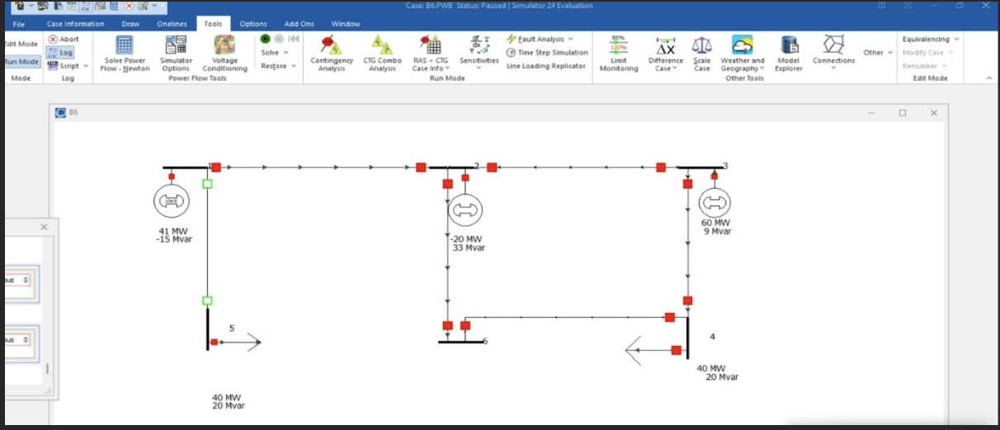
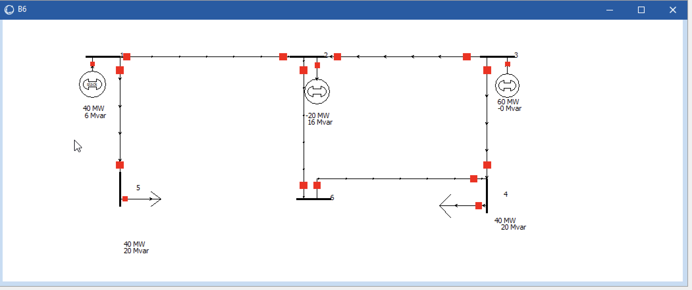

# ⚡ Load Flow Analysis and Fault Detection using PowerWorld Simulator

## 📖 Project Overview

This project was developed as part of my B.Tech Electrical & Electronics Engineering coursework.

The project uses **PowerWorld Simulator** to perform load flow analysis and fault detection on an IEEE 6-Bus Power System. It helps analyze voltage profiles, power flow, and system behavior during fault conditions.

---

## 🎯 Objectives

- Perform Load Flow Analysis
- Analyze Bus Voltage Profile
- Calculate Active and Reactive Power Flow
- Study Transmission Line Loading
- Detect Fault Conditions
- Observe Power System Performance

---

## 🛠 Software Used

- PowerWorld Simulator

---

## 📂 Project Files

- B6.PWB (PowerWorld Case File)
- Project Report (PDF)
- Presentation (PPT)
- Simulation Screenshots

---

## 📊 Simulation Results

### 🔹 One-Line Diagram

This diagram represents the IEEE 6-bus power system including generators, loads, and transmission lines.

---

### 🔹 Load Flow Result

The load flow analysis shows active and reactive power distribution along with power flow direction in the network.

---

### 🔹 Fault Analysis
*(Screenshot will be added)*

---

## 📚 Skills Gained

- Power System Analysis
- Load Flow Studies
- Fault Analysis
- PowerWorld Simulator
- Electrical Power Systems

---

## 👩‍🎓 Author

**Preeti Yalgar**

B.Tech – Electrical & Electronics Engineering

Sharnbasva University, Kalaburagi
